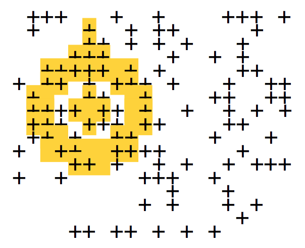
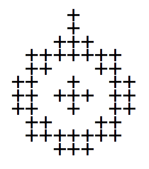

## Bliffoscope Data Analysis

### Problem Definition:

It's April 1, 2143. Your job is to save the world.

Well, a little world. Specifically the asteroid X8483-Z-32 that you and Alphonso Bliffageri are stuck on. You've been stranded there ever since the evil Rejectos hit your spaceship with a slime torpedo fired from one of their spaceships. Now you and Alphonso are trying to save your little world from a concerted Rejectos attack.

The main problem you have is detecting the Rejectos spaceships and slime torpedos, because they're protected with cloaking devices. Alphonso has invented an imaging anti-neutrino system (which he has modestly named the “Bliffoscope”) that provides the only information you have about their location, but it's not very good information. First, the Bliffoscope only detects whether there are anti-neutrinos at any particular point on an image, not what their intensity is. In other words, the data it provides is the equivalent of a black-and-white image. Second, the data is very noisy – even if there are no targets in a particular area, some pixels will be “on”, and if there is a target, some of its pixels will be “off”. For example, here's a 20 x 20 sample of raw data from the Bliffoscope (where each “+” is a pixel that is on):



Below is a sample image of a slime torpedo:



On the Bliffoscope data, we've highlighted the pixels that should be “on” for a slime torpedo. You can see that more of the highlighted pixels are “on” in the highlighted area than in other areas of the image. You must use this difference to locate the targets in the Bliffoscope data.

See provided files:

1. [TestData.blf](data/TestData.blf): a 100 x 100 swath of raw Bliffoscope data containing between four and ten targets.

2. [SlimeTorpedo.blf](data/SlimeTorpedo.blf): a perfect image of a slime torpedo.
 
3. [Starship.blf](data/Starship.blf): a perfect image of a Rejectos starship.

Objective:

1. Design and write a Java package that can analyze arbitrary-sized Bliffoscope images, returning a list of targets found. Each target found should include the target type found (starship or slime torpedo), the coordinates of the target on the Bliffoscope data, and some indication of your confidence in the target detection.

2. Design and write test code that submits the test data to your package and prints the results returned by your package.

## Solution:
See main class [BliffoscopeMain.java](BliffoscopeMain.java).

Bliffoscope Detector Results with 75%+ accuracy:
```
Found 4 targets:
slime torpedo (79%) detected in area [ (0,0), (10,0), (0,12), (10,12) ]
starship (77%) detected in area [ (55,25), (68,25), (55,35), (68,35) ]
starship (75%) detected in area [ (43,67), (56,67), (43,77), (56,77) ]
starship (75%) detected in area [ (64,33), (77,33), (64,43), (77,43) ]
```

Bliffoscope Detector Results with 71%+ accuracy:
```
Found 10 targets:
slime torpedo (79%) detected in area [ (0,0), (10,0), (0,12), (10,12) ]
starship (77%) detected in area [ (55,25), (68,25), (55,35), (68,35) ]
starship (75%) detected in area [ (43,67), (56,67), (43,77), (56,77) ]
starship (75%) detected in area [ (64,33), (77,33), (64,43), (77,43) ]
slime torpedo (73%) detected in area [ (25,78), (35,78), (25,90), (35,90) ]
starship (72%) detected in area [ (56,25), (69,25), (56,35), (69,35) ]
starship (72%) detected in area [ (42,67), (55,67), (42,77), (55,77) ]
starship (71%) detected in area [ (78,9), (91,9), (78,19), (91,19) ]
slime torpedo (71%) detected in area [ (20,36), (30,36), (20,48), (30,48) ]
slime torpedo (71%) detected in area [ (10,45), (20,45), (10,57), (20,57) ]
```

### Notes:
- By far one of my favorite problems I've encountered while interviewing for a Software Engineer position. It was administered as a take home exam with no particular time constraints.